# Asuna Labs 🚀

**Innovating Tomorrow, Engineering Today**

_We build the software that powers your vision. From innovative web platforms to our own suite of intelligent apps, we are the dedicated technical team you've been searching for._

---

## 🎯 What We Do

At **Asuna Labs**, we're a full-stack software development company that transforms ideas into powerful digital solutions. We specialize in:

### 🛠️ Custom Software Development

- **Web Applications** - React, Vue, Angular frontends with Node.js, Python, .NET backends
- **Mobile Applications** - Native iOS/Android and cross-platform (React Native, Flutter)
- **AI & Machine Learning** - Predictive analytics, NLP, computer vision, chatbots
- **Cloud & DevOps** - AWS, Azure, Google Cloud with CI/CD pipelines and auto-scaling

### 📱 Our SaaS Products

#### DevFlow - Project Management for Developers

> Streamline your development workflow with intelligent task management, code review tracking, and team collaboration tools built specifically for development teams.

**Features:**

- ⚡ Intelligent Sprint Planning
- 🔍 Code Review Automation
- 👥 Real-time Team Collaboration
- 📊 Advanced Analytics & Reporting

#### InsightAI - Analytics Made Simple

> Transform your data into actionable insights with our AI-powered analytics platform designed for modern businesses.

**Features:**

- 🤖 AI-powered insights
- 📈 Real-time dashboards
- 🤝 Team collaboration tools
- 🔒 Enterprise-grade security

---

## 🏢 Industries We Serve

| 💳 FinTech     | 🏥 Healthcare    | 🛒 E-commerce            | 🎓 Education  |
| -------------- | ---------------- | ------------------------ | ------------- |
| 🏢 Real Estate | 🏭 Manufacturing | 🎬 Media & Entertainment | ❤️ Non-Profit |

---

## 🚀 Our Process

```mermaid
graph LR
    A[🔍 Discovery & Planning] --> B[🎨 Design & Architecture]
    B --> C[⚙️ Development & Testing]
    C --> D[🚀 Deployment & Support]
```

1. **Discovery & Planning** - Deep dive into your business requirements and goals
2. **Design & Architecture** - User-centric designs and robust technical architecture
3. **Development & Testing** - Agile development with continuous testing
4. **Deployment & Support** - Seamless deployment with ongoing monitoring and maintenance

---

## 🛠️ Technology Stack

### Frontend

### Backend

### Mobile

### Cloud & DevOps

### Database

---

## 🏆 Client Success Stories

> _"Asuna Labs transformed our entire digital presence. The new platform exceeded all our expectations."_
>
> **Sarah Johnson, CTO at RetailMax**

### Featured Project: E-commerce Platform Overhaul

- **Challenge**: Modernize outdated e-commerce platform for increased traffic
- **Solution**: Complete rebuild with React, Node.js, microservices architecture
- **Results**:
  - 📈 45% increase in conversion rate
  - ⚡ 60% reduction in page load times
  - 📱 80% increase in mobile sales

**Technologies Used**: React, Node.js, MongoDB, AWS, Stripe, Redis

---

## 📊 GitHub Stats

---

## 🤝 Let's Work Together

Ready to transform your business with cutting-edge technology? We'd love to hear about your project!

---

## 📫 Connect With Us

- 🌐 **Website**: [asunalabs.com](https://asunalabs.com)
- 💼 **LinkedIn**: [linkedin.com/company/asuna-labs](https://www.linkedin.com/company/asuna-labs)
- 🐦 **Twitter**: [@asuna_labs](https://twitter.com/asuna_labs)
- 📧 **Email**: hello@asunalabs.com

---

**Built with ❤️ by the Asuna Labs Team**

_Innovating Tomorrow, Engineering Today_

